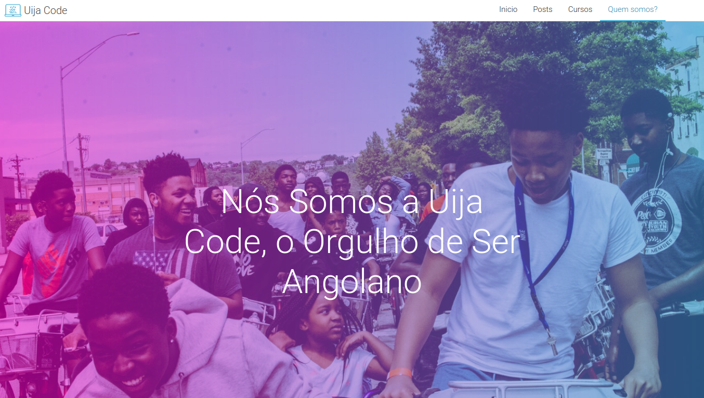

# Uija Code

### What's Uija Code?
Uija Code is a plataform maintened by me, with the main propose of share my knowledges about programming and my self experience at the IT are!

### Why did I create Uija Code?
I created Uija Code first of all for a project that I maked at one subject that I had at University, the main propouse of it was to pass the class and nothing after that, but I saw that I can share my knowledge by a webpage and I also see that I can help someone doing this.

### When I created Uija Code?
At the middle of 2019.

### What do you wanna reach with Uija Code?
I want help others like I was helped but in my own way of approach!

## Site Images

## Do you want access the site?
[click here](https://eufraniodiogo.github.io/Meu-Web-Site/index.html)
